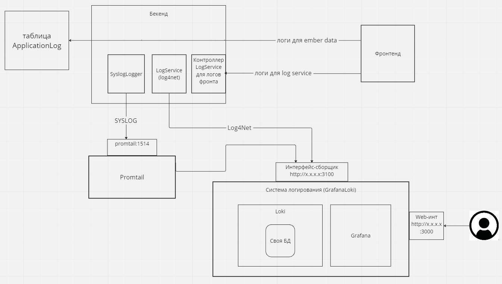

# Flexberry.Logging.Sample

Репозиторий-пример для демонcтрации работы системы логирования на основе GrafanaLoki

В примере реализованы следующие функции:

- Сбор логов сторонним сборщиком Loki.
- Реализация Syslog логгера на основе стандартного логгера Netcore.
- Promtail в качестве syslog сервера-сборщика с последующим преобразованием и отправкой в Loki.
- Web-интерфейс Grafana для просмотра, выборки и аналитики логов, хранящихся в Loki.

Репозиторий включает в себя следующие сервисы;

- App
- БД приложения
- Сервис promtail
- Сервис Loki
- Сервис Grafana

### Общая схема стенда

### Запуск в Docker

1) Собрать образы с помощью Flexberry.Logging.Sample/Docker/create-image.cmd

2) Запустить контейнеры с помощью Flexberry.Logging.Sample/Docker/start.cmd

**Web-интерфейс Grafana**:

http://localhost:3000

login: admin
pass: usr123

После первого запуска нужно добавить Loki в качестве DataSource

[Инструкция по работе с Grafana](/docs/Работа%20с%20Grafana%20Loki.md).

