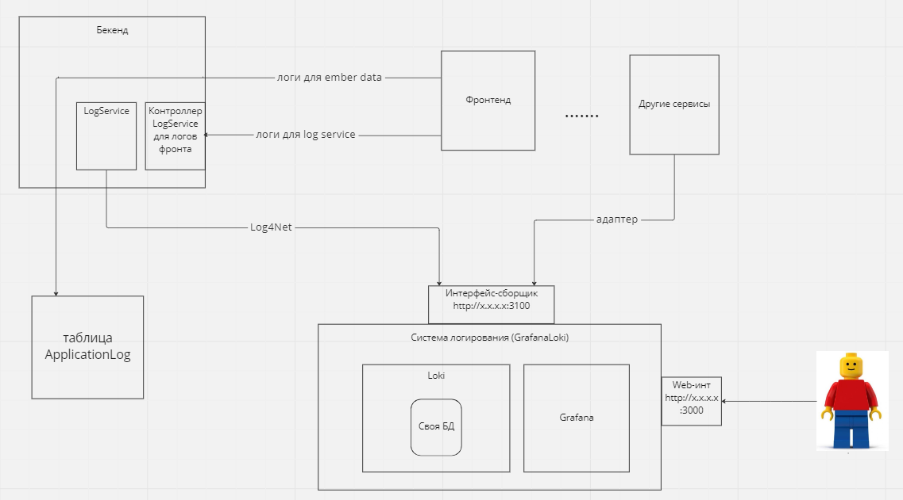

# Устройство фронтенда и бэкенда в лог-сервисах

## Общее устройство лог-сервиса

Архитектура лог-сервиса представляется следующим образом:

Фронтенд шлет логи с помощью ember data напрямую в таблицу ApplicatonLog базы данных. Чтобы отправлять логи по http в лог-сервис, в бэкенд нужно добавить пакет `NewPlatform.Flexberry.LogService.WebApi`. Пакет поддерживает работу и с `netframework` и `netcore`. Внутри пакета контроллер принимает на вход логи, а LogService отправляет лог дальше в log4net, который направляет их в Grafana Loki.

Для использования NewPlatform.Flexberry.LogService.WebApi в своем приложении потребуется настроить регистрацию роута. По умолчанию для `netcore` это делается в файле `ODataBackend/Startup.cs` в методе `Configure`:

    app.UseMvc(routes =>
        {
            string baseUrl = new Uri(Configuration["BackendRoot"]).ToString();
            routes.MapLogsRoute(baseUrl);
        });

Для `netframework` в методе Configure в файле ODataBackend\App_Start\ODataConfig.cs вызывается метод `config.MapLogControllerRoute();` Если не задавать параметров, то по умолчанию `routeName = "logs"`, но можно задать и свой. Необязательно залезать в код odata, можно создать свой RouteConfig, добавить в него аналогичный метод Configure и вызвать из метода Application_Start.

Поступивший роут преобразуется как:

    Route(routeName, "api/logs", defaults: new { controller = "Logs", action = "PostLog" })

Таким образом, логи будут доступны по "адрес_вашего_роута/api/logs".

## Аппендеры log4net

Для записи лога на бэкенде используется библиотека `Log4Net`. Настройка log4net может осуществляться как и внутри фала App.config, так и отдельном файле например в файле Test.exe.log4net, где Test меняется на название приложения или Web.config для web приложений.

В файле App.config или Web.config в самое начало после открытого тега `<configuration>` вставляем:

    <configSections>
      <section name="log4net" type="System.Configuration.IgnoreSectionHandler"/>
    </configSections>

Эта настройка указывает, что настройки для log4net находятся в секции "log4net". "System.Configuration.IgnoreSectionHandler" - указывает чем будет разбираться этот файл. Далее вставляем основные настройки логера (настройки могут варьироваться для разных проектов):

    <log4net>
    <appender name="LogFileAppender" type="log4net.Appender.RollingFileAppender">
      <param name="File" value="logs/odatabackend.log" />
      <param name="AppendToFile" value="true" />
      <param name="RollingStyle" value="Date" />
      <param name="Encoding" value="utf-8" />
      <layout type="log4net.Layout.PatternLayout">
        <param name="ConversionPattern" value="%-5p %d{yyyy-MM-dd hh:mm:ss} [%t] %m%n" />
      </layout>
    </appender>
    <appender name="ConsoleAppender" type="log4net.Appender.ConsoleAppender">
      <layout type="log4net.Layout.PatternLayout">
        <conversionPattern value="%date [%thread] %-5level %logger [%property{NDC}] - %message%newline" />
      </layout>
    </appender>
    <appender name="LokiAppender" type="log4net.Appender.LokiAppender, log4net.Appender.Loki">
      <BufferSize  value="1" />
      <ServiceUrl value="http://localhost:3100" />
      <label>
        <key value="environment" />
        <value value="debug" />
      </label>
      <label>
        <key value="app" />
        <value value="FlexberrySampleLogging" />
      </label>
    </appender>
    <root>
      <level value="DEBUG" />
      <appender-ref ref="LogFileAppender" />
      <appender-ref ref="ConsoleAppender" />
      <appender-ref ref="LokiAppender" />
    </root>
    </log4net>

`appender` - описывает куда будет выводится лог, в данном случае вывод происходит в перезаписываемый файл - log4net.Appender.RollingFileAppender, в консоль, и отправляется в Loki. Для Loki также установлен пакет log4net.LokiAppender.

`level value` - уровень записи лога. мы выводим сообщения не ниже уровня DEBUG.

Для отправки сообщений в лог используется пакет `LogService` -  пакет для ведения логов в log4net. Этот пакет - обертка класса `ILog`, который ялвяется стандартым интерфейсом отправки сообщений log4net framework.  Лог отправляется в виде: `LogService.LogInfo("Это лог.");` Где `LogInfo` - это уровень лога. Лог может быть не только строкой, но и в формате json. Подробнее об этом - в статье "Работа с Grafana Loki".

## Изменения в лог-сервисе фронтенда

Ember с помощью Ember.Logger записывает логи в базу данных в таблицу LogApplication. Теперь в `environment` будет доступен флаг `sendViaHttp`. С включенным флагом эмбер-методы отправки лога будут переопределяться и отправляться в лог-сервис. Флаг `httpLogServiceUrl` указывает куда именно их отправлять.
