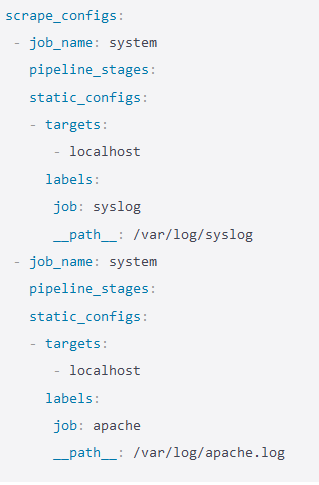
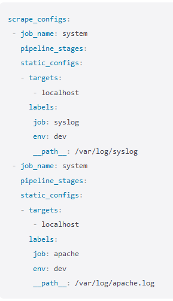
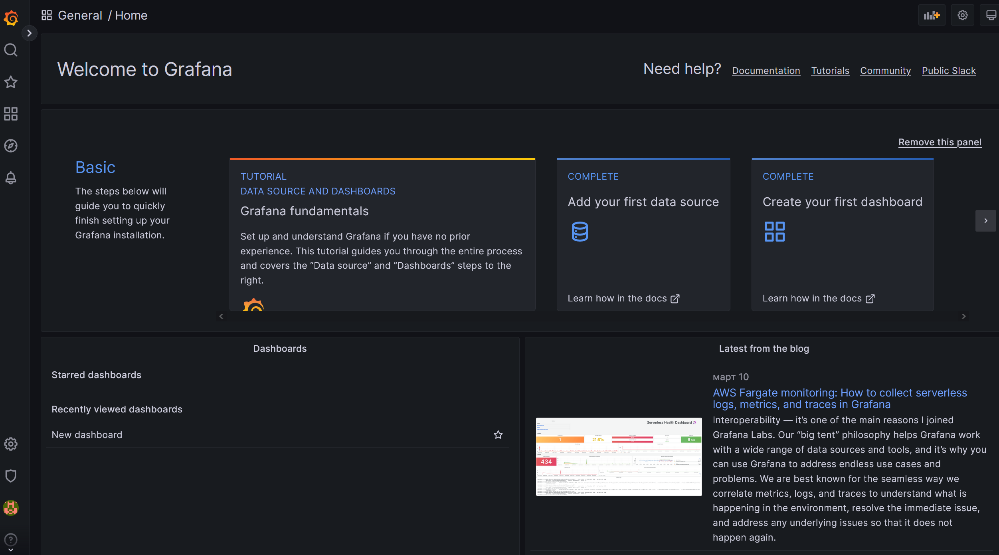
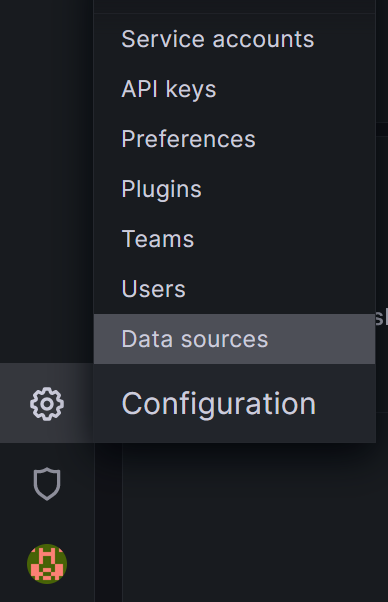
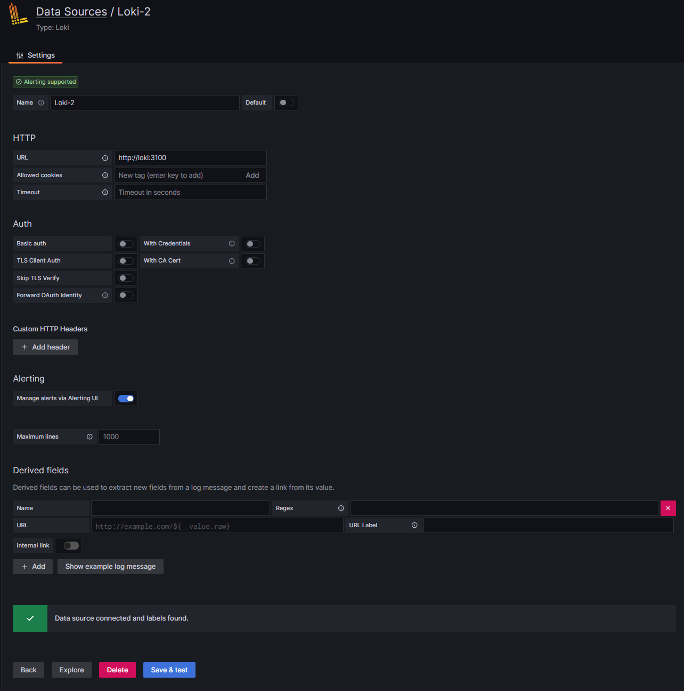
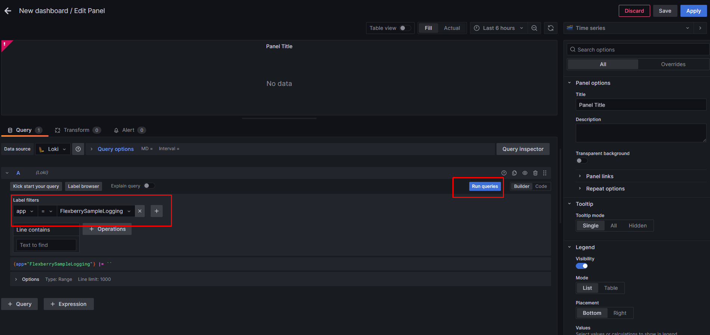
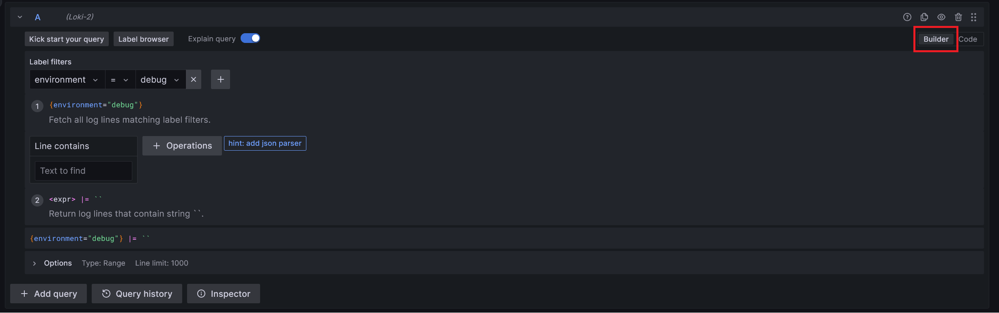
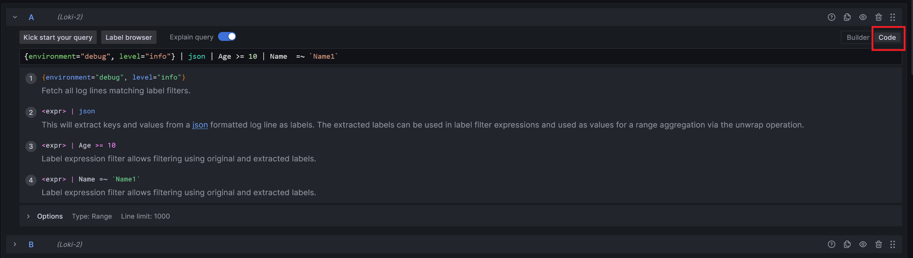

# Работа с Grafana Loki

## Принципы работы

Стек `Grafana Loki` состоит из трёх компонентов: Loki, Grafana, Promtail (опционально). `Promtail` собирает логи, обрабатывает их и отправляет в `Loki`. `Loki` их хранит. А `Grafana` умеет запрашивать данные из `Loki` и показывать их. `Loki` можно использовать не только для хранения логов и поиска по ним. Весь стек даёт большие возможности по обработке и анализу поступающих данных.

`Grafana` — это платформа с открытым исходным кодом для визуализации, мониторинга и анализа данных. `Grafana` позволяет пользователям создавать дашборды с панелями, каждая из которых отображает определенные показатели в течение установленного периода времени. Каждый дашборд универсален, поэтому его можно настроить для конкретного проекта или с учетом любых потребностей разработки и/или бизнеса. Помимо `Loki` этот инструмент поддерживает множество других источников данных (`Prometheus`, `MySQL`, `Postgres` и т. д.). Для каждого источника данных в `Grafana` предусмотрен настраиваемый редактор запросов и специальный синтаксис.

`Loki` хранит данные в TSDB object store базе. `Time Series Database (TSDB)` — это база данных, оптимизированная для данных временных рядов или временных меток. данные там хранятся в связке время-значение.
`Object store` -способ хранения данных в неструктурированном формате, который и называется объектом.

Традиционные системы парсят строку целиком, включая поля с большим количеством уникальных значений `user_id` и `item_id`, и сохраняют всё в большие индексы. Преимуществом данного подхода является то, что можно выполнять сложные запросы быстро, так как почти все данные — в индексе. Но за это приходится платить тем, что индекс становится большим, что выливается в требования к памяти. В итоге полнотекстовый индекс логов сопоставим по размеру с самими логами. Для того чтобы по нему быстро искать, индекс должен быть загружен в память. И чем больше логов, тем быстрее индекс увеличивается и тем больше памяти он потребляет.

Подход `Loki` требует, чтобы из строки были извлечены только необходимые данные, количество значений которых невелико. Таким образом, мы получаем небольшой индекс и можем искать данные, фильтруя их по времени и по проиндексированным полям, а затем сканируя оставшееся регулярными выражениями или поиском подстроки. Процесс кажется не самым быстрым, но `Loki` разделяет запрос на несколько частей и выполняет их параллельно, обрабатывая большое количество данных за короткое время. Количество шардов и параллельных запросов в них конфигурируется; таким образом, количество данных, которое можно обработать за единицу времени, линейно зависит от количества предоставленных ресурсов.

Этот компромисс между большим быстрым индексом и маленьким индексом с параллельным полным перебором позволяет Loki контролировать стоимость системы. Её можно гибко настраивать и расширять в соответствии с потребностями.

По умолчанию `Loki` настроен на создание 3 реплик журналов для защиты от сбоев и потерь данных. Но это происходит перед записью в долговременную память. Сначала данные попадают в ingester, в оперативную память, точнее в несколько инджестеров, и потом либо по прошествии определенного времени, либо по их лимиту заполнения переписываются в долговременную память в сжатом виде. И благодаря методу дедупликации данных это не занимает сильно больше места.

## Использование Grafana Loki в Flexberry.Logging.Sample

В `Flexberry.Logging.Sample` сервисы `Grafana Loki` развернуты в докере. Образы `Loki` и `Promtail` собираем сами, образ `Grafana` взяли готовый официальный. Соответственно в docker-compose указываем три этих образа. К образу Garafana приписываем логин/пароль, по которым будем заходить в веб-интерфейс графаны.

Для образов `Loki` и `Promtail` прописываем конфигурационные файлы.

Для конфига `Loki`:

* `auth_enabled: false` - нужен для аутентификации через X-Scope-OrgID с Cortex, базой данных Loki. Не используем.
* В разделе `server` прописываем порты "прослушки".
* Блок `common` устанавливает общие определения, которые будут использоваться разными компонентами: настройки путей, конфигурация ring (используется для хеширования) и т.д.
* Блок `query_range` настраивает разделение запросов и кеширование.
* Блок `schema_config` настраивает схемы с заданных дат. Можно превентивно задать новые настройки и планировать изменения. Прописываем хранилища для индексов (поддерживаются: aws, aws-dynamo, gcp, bigtable, bigtable-hashed, cassandra, boltdb, boltdb-shipper; у нас используется boltdb-shipper, он позволяет запускать Grafana Loki без какой-либо зависимости от хранилищ NoSQL для хранения индекса), чанков (самих логов), версию хранилища Loki и т.д.
* В блоке `ruler` задаем список URL-ов, куда отправлять уведомления.

Для конфига `Promtail`:

* В разделе `server` прописываем порты "прослушки".
* Блок `positions` определяет как сохранять promtail файлы
* `clients` описывает, как Promtail должен подключаться к нескольким экземплярам Grafana Loki и отправлять каждому логи (однако рекомендуется запускать несколько клиентов Promtail параллельно, если вы хотите отправлять данные на несколько удаленных экземпляров Loki.).
* Блок `scrape_configs` настраивает, как Promtail может фильтровать логи.

> **_NOTE:_**  Promtail — это агент, который отправляет содержимое локальных журналов в экземпляр Grafana Loki. Необязательно использовать именно Promtail для этих целей.

## Структура логов и использование лейблов

Логи состоят из лейблов (`label`), метки даты времени (`time`), информационного сообщения (`line`), идентификатора отметки времени, генерируемого графаной (`tsNs`), идентификатора строки (`id`).

Поиск логов происходит сначала поиском по лейблам, по ним находятся нужные чанки и они также фильтруются при необходимости.

Некоторые лейблы определяются автоматически, например, host - с какого хоста отправлен лог, или level - уровень важности лога (info, error, warning и т.д.).
Но также есть кастомные лейблы. На данный момент, на бэке в App.config задаются лейблы app и environment - они будут одинаковыми для всех отправленных логов. Чтобы задать более разнообразные лейблы, их задают в конфигах промтейла в блоке `scrape_configs`.

> **_NOTE:_** Также Grafana может преображать отправленный ей текст лога в формате json в лейблы, подробнее об этом - в разделе "Запросы в Grafana".

При поиске логов в Grafana используются регулярные выражения и разновидность SQL - LogQL. Чтобы уменьшить трудозатраты, важно продумать систему лейблов заранее.

Например, есть лейбл `job`, который в одном случае равен `syslog`, в другом - `apache` в зависимости от пути сохранения лога:

Но если нам нужно получить логи и syslog, и apache, при поиске придется делать запрос `{job=~”apache|syslog”}`. Если такой запрос придется делать часто, то, чтобы было проще, можно добавить еще один лейбл env, и тогда все необходимое можно будет найти по `{env=”dev”}`:

В следующем примере для задания лейблов используется regex. Из лога вычленяются значения `action` и `status_code` и записываются под соответствующими лейблами:

    - job_name: system
       pipeline_stages:
          - regex:
            expression: "^(?P<ip>\\S+) (?P<identd>\\S+) (?P<user>\\S+) \\[(?P<timestamp>[\\w:/]+\\s[+\\-]\\d{4})\\] \"(?P<action>\\S+)\\s?(?P<path>\\S+)?\\s?(?P<protocol>\\S+)?\" (?P<status_code>\\d{3}|-) (?P<size>\\d+|-)\\s?\"?(?P<referer>[^\"]*)\"?\\s?\"?(?P<useragent>[^\"]*)?\"?$"
        - labels:
            action:
            status_code:
       static_configs:
       - targets:
          - localhost
         labels:
          job: apache
          env: dev
          __path__: /var/log/apache.log

## Работа с запущенным стеком Grafana Loki

Заходим по указанному в образе Grafana в docker-compose порту (по умолчанию это <http://localhost:3000>) и заходим в систему, используя логин/пароль, указанные там же. Попадаем на главную страницу:

Добавляем дата-сервис. Для этого слева в меню выбираем пункт `Data Sources`:

Нажимаем  `Add new data source` и выбираем из списка `Loki`. На открывшейся странице настраиваем подключение к Loki. Указываем `URL` Loki, внизу страницы нажимаем `Save & test`. Должна появиться зеленая галочка с надписью "Data source connected and labels found".

Добавляем дашборд для просмотра логов. Чтобы создать дашборд выбираем соответствующую строку на панели слева в разделе `Dashboards`:

Далее нажимаем "Add a new panel". Откроется страница редактирования панели дашборда. Выбираем источник данных - Loki, хотя бы один лейбл для отображения:

После чего в верхней панели появится выбор отображения логов. Выбираем удобный формат отображения, например таблицу, сохраняем панель и применяем дашборд.

### Запросы в Grafana

Инструмент поиска по логам в Grafana есть на панели редактирования дашборда, а так же в меню слева в разделе `Explore`.

У инструмента поиска есть два режима: `builder` и `code`. Они переключаются в правом верхнем углу. Режим `builder` выглядит следующим образом:

Здесь можно задавать фильтры для поиска, а также задавать функции для фильтрации. Grafana анализирует имеющиеся у нее данные и предлагает подсказки в builder режиме. В примере можно увидеть, как Grafana предлагает добавить json parser в запрос.  Запросы могут быть составные, содержать несколько условий. Самих запросов также может быть несколько, в таком случае найдутся логи отдельно для каждого запроса.

Запрос, который мы составили в builder режиме отображается также в виде кода в нижней части панели, однако не редактируется. Благодаря поставленной галочке `Explain query`, под каждым условием есть объяснение.

В режиме `code` присутствует все то же самое, за исключением конструктора запросов. В этом режиме редактируется запрос в виде кода.

Под запросами внизу есть кнопки `Query history`, которая покажет историю запросов, а также `Inspector`, которая покажет различную информацию и статистику по текущим запросам.

Grafana может понимать логи различных форматов, и по-разному с ними работает. Например, если послать лог в виде строки, то фильтровать такие логи можно будет функциями "строка содержит / строка не содержит".  Текст же лога в формате `json`, Grafana может преображать в лейблы, а их значения воспринимать не только как строки, но и численные, булевые значения и т.д.
